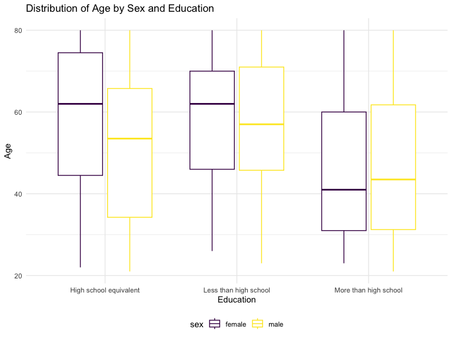
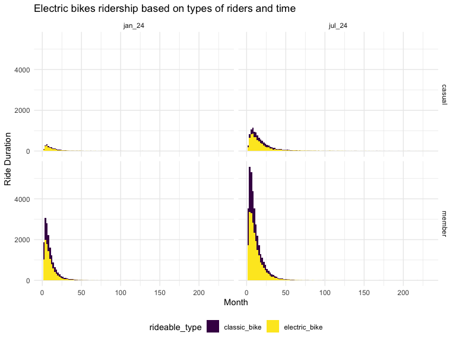

P8105 Homework 3
================

# Problem 2

## Loading, tidying, merging, and organizing the data sets

``` r
accel_df = read_csv(file = "./hw3_data/nhanes_accel.csv") |> 
  janitor::clean_names()
```

    ## Rows: 250 Columns: 1441
    ## ── Column specification ────────────────────────────────────────────────────────
    ## Delimiter: ","
    ## dbl (1441): SEQN, min1, min2, min3, min4, min5, min6, min7, min8, min9, min1...
    ## 
    ## ℹ Use `spec()` to retrieve the full column specification for this data.
    ## ℹ Specify the column types or set `show_col_types = FALSE` to quiet this message.

``` r
covar_df = read_csv(file = "./hw3_data/nhanes_covar.csv", skip = 4) |> 
  janitor::clean_names()
```

    ## Rows: 250 Columns: 5
    ## ── Column specification ────────────────────────────────────────────────────────
    ## Delimiter: ","
    ## dbl (5): SEQN, sex, age, BMI, education
    ## 
    ## ℹ Use `spec()` to retrieve the full column specification for this data.
    ## ℹ Specify the column types or set `show_col_types = FALSE` to quiet this message.

``` r
nhanes_df = accel_df |> 
  left_join(covar_df, by = "seqn") |> 
  filter(age >= 21) |>
  mutate(
    sex = as.character(sex), 
    sex = case_match(
      sex,
      "1" ~ "male",
      "2" ~ "female"),
    education = as.character(education),
    education = case_match(
      education,
      "1" ~ "Less than high school",
      "2" ~ "High school equivalent",
      "3" ~ "More than high school"
    )
  ) |>
  distinct()
```

## Number of men and women in each education category

``` r
nhanes_df |> 
  group_by(education, sex) |> 
  summarize(
    count = n(), .groups = 'drop') |> 
  pivot_wider(
    names_from = education, 
    values_from = count) |> 
  knitr::kable(
    caption = "Number of Men and Women in Each Education Category"
  )
```

| sex    | High school equivalent | Less than high school | More than high school |
|:-------|-----------------------:|----------------------:|----------------------:|
| female |                     23 |                    29 |                    59 |
| male   |                     36 |                    28 |                    56 |

Number of Men and Women in Each Education Category

According to the table, participants in the ‘More than high school’
education category make up most of the total population compared to the
‘High school equivalent’ and ‘Less than high school’ education
categories. Within the ‘High school equivalent’ category, there are 13
more males than females, 1 more female than males within the ‘Less than
high school’ category, and 3 more females than males within the ‘More
than high school’ category.

### Visualization

``` r
nhanes_df |> 
  group_by(sex, education, age) |> 
  ggplot(aes(x = education, y = age, color = sex)) +
  geom_boxplot() +
  labs(
    title = "Distribution of Age by Sex and Education",
    x = "Education",
    y = "Age"
  )
```



A boxplot is used to visualize the median age between men and women
across the different education categories as it is much easier to
interpret for readers than other plots. The plot shows that females have
a higher median age in the ‘High school equivalent’ category and the
‘Less than high school’ category. However, men have a slightly higher
median age in the ’More than high school category.

## Total activities vs. age

``` r
total_df = 
  nhanes_df |> 
  mutate(
    total_activity = rowSums(across(c(min1:min1440)))
  ) |> 
  select(seqn:education, total_activity)
```

``` r
total_df |> 
  ggplot(aes(x = age, y = total_activity, color = sex)) +
  geom_point(alpha = 0.5) +
  geom_smooth(se = FALSE) +
  facet_grid(~ education) +
  labs(
    title = "Total Activity vs. Age by Gender and Education Level",
       x = "Age (years)",
       y = "Total Activity over 24 hours")
```

    ## `geom_smooth()` using method = 'loess' and formula = 'y ~ x'


## 24-hour activity time courses for each education level

``` r
panel_df = 
  nhanes_df |> 
  select(-seqn, -bmi, -age) |> 
  group_by(sex, education) |> 
  summarize(across(min1:min1440, mean)) |> 
  pivot_longer(
    min1:min1440, 
    names_to = "minutes",
    values_to = "activity"
  )
```

    ## `summarise()` has grouped output by 'sex'. You can override using the `.groups`
    ## argument.

``` r
panel_df |> 
  ggplot(aes(x = minutes, y = activity, color = sex)) +
  geom_point(alpha = 0.5) +
  geom_smooth(se = FALSE) +
  facet_grid(education ~ .) +
  labs(
    title = "Progression of activity over 24 hours"
  )
```

    ## `geom_smooth()` using method = 'loess' and formula = 'y ~ x'


# Problem 3

## Importing, cleaning, and tidying data on rides taken on the NYC Citi Bike system

``` r
jan_2020 = read_csv(file = "./hw3_data/Jan_2020_Citi.csv") |> 
  drop_na() |> 
  janitor::clean_names() |> 
  mutate(month_year = "jan_20") |> 
  select(month_year, everything())
```

    ## Rows: 12420 Columns: 7
    ## ── Column specification ────────────────────────────────────────────────────────
    ## Delimiter: ","
    ## chr (6): ride_id, rideable_type, weekdays, start_station_name, end_station_n...
    ## dbl (1): duration
    ## 
    ## ℹ Use `spec()` to retrieve the full column specification for this data.
    ## ℹ Specify the column types or set `show_col_types = FALSE` to quiet this message.

``` r
jan_2024 = read_csv(file = "./hw3_data/Jan_2024_Citi.csv") |> 
  drop_na() |> 
  janitor::clean_names() |> 
  mutate(month_year = "jan_24") |> 
  select(month_year, everything())
```

    ## Rows: 18861 Columns: 7
    ## ── Column specification ────────────────────────────────────────────────────────
    ## Delimiter: ","
    ## chr (6): ride_id, rideable_type, weekdays, start_station_name, end_station_n...
    ## dbl (1): duration
    ## 
    ## ℹ Use `spec()` to retrieve the full column specification for this data.
    ## ℹ Specify the column types or set `show_col_types = FALSE` to quiet this message.

``` r
july_2020 = read_csv(file = "./hw3_data/July_2020_Citi.csv") |>  
  drop_na() |> 
  janitor::clean_names() |> 
  mutate(month_year = "jul_20") |> 
  select(month_year, everything())
```

    ## Rows: 21048 Columns: 7
    ## ── Column specification ────────────────────────────────────────────────────────
    ## Delimiter: ","
    ## chr (6): ride_id, rideable_type, weekdays, start_station_name, end_station_n...
    ## dbl (1): duration
    ## 
    ## ℹ Use `spec()` to retrieve the full column specification for this data.
    ## ℹ Specify the column types or set `show_col_types = FALSE` to quiet this message.

``` r
july_2024 = read_csv(file = "./hw3_data/July_2024_Citi.csv") |>
  drop_na() |> 
  janitor::clean_names() |> 
  mutate(month_year = "jul_24") |> 
  select(month_year, everything())
```

    ## Rows: 47156 Columns: 7
    ## ── Column specification ────────────────────────────────────────────────────────
    ## Delimiter: ","
    ## chr (6): ride_id, rideable_type, weekdays, start_station_name, end_station_n...
    ## dbl (1): duration
    ## 
    ## ℹ Use `spec()` to retrieve the full column specification for this data.
    ## ℹ Specify the column types or set `show_col_types = FALSE` to quiet this message.

``` r
citibike_df = 
  bind_rows(jan_2020, jan_2024, july_2020, july_2024)
```

## Total number of rides in each combination of year and month, separating casual riders and Citi Bike members

``` r
citibike_df |> 
  group_by(month_year, member_casual) |> 
  summarize(
    count = n(), .groups = 'drop') |> 
  pivot_wider(
    names_from = "member_casual", 
    values_from = "count") |> 
  knitr::kable(
    caption = "Total number of rides by casual riders and Citi Bike members"
  )
```

| month_year | casual | member |
|:-----------|-------:|-------:|
| jan_20     |    980 |  11418 |
| jan_24     |   2094 |  16705 |
| jul_20     |   5625 |  15388 |
| jul_24     |  10843 |  36200 |

Total number of rides by casual riders and Citi Bike members

## 5 most popular starting stations for July 2024

``` r
july_2024 |> 
  group_by(start_station_name) |> 
  count(start_station_name, name = "ride_count") |> 
  arrange(desc(ride_count)) |> 
  filter(ride_count >= 145) |> 
  knitr::kable(
    col.names = c("Origin Station Name", "Number of Rides")
  )
```

| Origin Station Name      | Number of Rides |
|:-------------------------|----------------:|
| Pier 61 at Chelsea Piers |             163 |
| University Pl & E 14 St  |             155 |
| W 21 St & 6 Ave          |             152 |
| West St & Chambers St    |             150 |
| W 31 St & 7 Ave          |             145 |

## Investigating the effects of day of the week, month, and year on median ride duration

``` r
citibike_df |> 
  group_by(month_year, weekdays) |> 
  summarize(
    median = median(duration, na.rm = TRUE)) |> 
  ggplot(aes(x = weekdays, y = median, color = month_year)) +
  geom_point() +
  facet_grid(. ~ month_year) +
  labs(
    title = "Ride duration over week and 4 timepoints",
    x = "Days of the Week", 
    y = "Median of Ride Duration"
  )
```

    ## `summarise()` has grouped output by 'month_year'. You can override using the
    ## `.groups` argument.


## Impact of month, membership status, and bike type on the ditribution of ride duration

``` r
citibike_df |> 
  group_by(month_year, rideable_type, member_casual) |> 
  select(month_year, rideable_type, member_casual, duration) |> 
  filter(month_year %in% c("jan_24", "jul_24")) |> 
  ggplot(aes(x = month_year, y = duration, fill = rideable_type)) +
  geom_violin() +
  facet_grid(member_casual ~ month_year) +
  labs(
    title = "Electric bikes ridership based on types of riders and time",
    x = "Month",
    y = "Ride Duration",
    color = "Types of Riders"
  )
```


